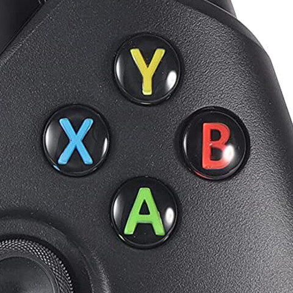
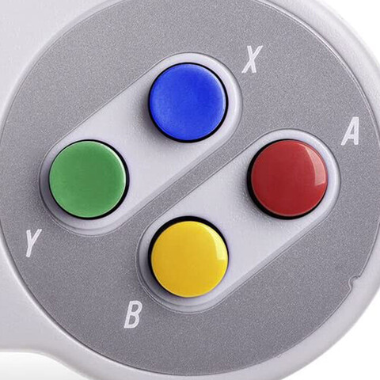
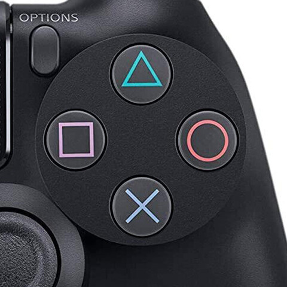

# Reminisce: a Batocera EmulationStation Theme

**Created by:** RetroNinja  
**Version:** v0.1.0 (Beta)  
**First release:** 2023  

## Introduction
Welcome to **Reminisce**, a theme designed for EmulationStation as an homage to the golden age of gaming. Created by RetroNinja, this theme brings together vintage video game artwork and modern UI design for a nostalgic yet sleek user experience. Whether you're a retro gaming aficionado or simply enjoy beautiful artwork, Reminisce offers something for everyone.

**Reminisce** combines two of my greatest passions: vintage video game artwork and retro-gaming. Sometimes the game art can be more fascinating than the games themselves! With Reminisce, you don't need games to enjoy the experience. Simply enable "Show Empty Systems" by navigating into 'Game Collection Settings' in the 'Main Menu,' and upon exiting to the system view, you'll be greeted by a gallery of striking artwork. It's visual nirvana for any retro enthusiast.

## Examples
Here's a preview of what you can expect from Reminisce. 

- Main Menu system overview showcasing vibrant retro art & console logos

- Detailed View showcasing console & game logos along with game overview and relavent metadata

- Game lists adorned with authentic box art
- Full-screen visual experiences for each system

## Supported Systems
(*See [SYSTEMS.md](SYSTEMS.md) for more information*)

## Included Features
- **Splash Video**: A custom splash video is included to complete the retro gaming experience from the moment you boot up. Simply copy it into `./share/splash` or `./userdata/splash` and viola! (*[described here](https://wiki.batocera.org/splash_boot)*)
- Splash Image: A custom splash image to use in place of the default boot splash and EmulationStation’s loading splash as described [here](https://wiki.batocera.org/splash_boot).
  
## Scraping for Reminisce
Reminisce relies on the following assets to work as expected and comes with some default content that it will display if any of this is missing or is omitted:
* Image (*screenshot*)
* Marquee (*logos*)
* Thumbnail (*boxart*)
* Video (*optional—worth it if you have the disk space.*)

To get the most out of Reminisce, make sure your games are scraped properly. For optimal results:
- Use the built-in Batocera scraper to download game box art, logos, and screenshots (*as indicated above*.)
- ***NOTE:** do NOT scrape image ‘mixes!’ These will destroy the experience **Reminisce** was meant to impart, not to mention will just look horrible*.

## Theme Settings
(*Found under `> Main Menu > User Interface Settings >  Theme Configuration`*)

|  |  |
|:---------------------------------------------------------:|:---------------------------------------------------------:|
|    Theme Config Example    |    Example Cont.    |

### Gamelist View Styles to choose from:
Reminisce supports several game list view styles to customize how your collection is displayed:
- **Tiles** (*default*): This is the default layout. Similar to a Netflix or Amazon Prime experience, but for retro games! Each game title pulls in an image of the boxart with logo, and plays a video clip of the selected game in the background (*if enabled*). If no video is scraped (*or is disabled*), only the boxart will be displayed.
- **Detailed**: A nice balance of speed and visual niceties. This view plays the selected game title video in the background, along with the game logo and an overview of the game. A list of game titles to scroll through will be positioned on the left side of the screen.
- **Detailed Boxart**: As above, but with a slightly tweaked layout to to accommodate box art in the view.
- **Grid**: Displays boxes automatically in a two row configuration. Will be refined in a later update.
- **Boxes**: Game box art configured for each system, which is nice if you love box art / Japanese variations like me. The grids have been auto-configured for the format of each system's box art, so it's recommended to keep the grid set to AUTO.

Try each style and see which one best fits your collection and aesthetic preferences!

### Your Controller Type :video_game::
This will confiure the controller button style and labeling you'll see throughout Reminisce based on the controller you'll be using. This should be self-explanitory, but...

|  |  |  |
|:-----------------------------------------------:|:----------------------------------------------:|:----------------------------------------------------:|
|    XBOX Style    |    Nintendo Style    |    Playstation Style    |

- **XBOX:** (*default*) The A, B, X, Y buttons are reversed compared to Nintendo controllers.
- **Nintendo:** The A, B, X, Y buttons are reversed compared to XBOX controllers.
- **PlayStation:** This controller uses symbols (△, ○, ✖, □) instead of lettered buttons.

Regardless of the chosen controller type, EmulationStation generally maps buttons using a North, South, East, and West directional layout. This setting ensures that Reminisce properly reflects your controller’s layout and displays the correct contextual help imagery for navigating both Reminisce and EmulationStation.

### Theme / Gamelist Video Delay:
If you’ve scraped game videos, Reminisce will display them as backgrounds in the system overview and game list views after a brief delay. With this setting, you can control when, or if, the videos appear.

- **2 Seconds:** (*default*) The scraped image will be replaced by the video after 2 seconds.
- **3 Seconds:** The scraped image will be replaced by the video after 3 seconds.
- **5 Seconds:** The scraped image will be replaced by the video after 5 seconds.
- **Video off:** Only the scraped image will be displayed, without any video.

### System Logos:
- **Mix:** (*default*) This is the theme default and uses a prefered mix of the three other options.
- **EU:** Uses European logos if available.
- **JP:** Uses Japanese logos if available.
- **US:** Uses US logos if available.

### Theme Overlay:
Display a scanline-effect overlay effect over the images and videos displayed in the main system overview and gamelist views.

- **No scanlines:** Don't show scanlines (theme default).
- **Light scanlines:** Show light scanlines over images and videos in individual system views / main menu.
- **Dark scanlines:** Show darker scanlines over images and videos in individual system views / main menu.

### Animations:
Reminisce utilizes subtle animations to provide a more polished user experience. However this could be anoying to some and for users of lower-powered devices, such as earlier versions of the Raspberry Pi, etc., you may want to turn off animations for a speedier experience.

- **Animations on:** Turn on the animations (theme default).
- **Animations off:** Turn off the animations.

### UI modes:
Change the color of the theme interface and accents.

- **Grey mode (default):** Uses a dark grey system-wide colour setting.
- **Darker mode:** Uses a darker system-wide colour setting.

## Thanks and Credits
(*See [CREDITS.md](CREDITS.md) for more information*)

## Notice
All logos, artwork, screenshots, and trademarks within this theme are the property of their respective owners. The use of these materials within Reminisce is solely for the purposes of enhancing the retro gaming experience and does not imply ownership by the theme creator.

## License

[Reminisce: a Batocera EmulationStation Theme](https://github.com/cdaters/es7-theme-reminisce) by [RetroNinja](https://daters.net) is licensed under [CC BY-SA 4.0](https://creativecommons.org/licenses/by-sa/4.0/?ref=chooser-v1)   

(*See [LICENSE](LICENSE) for more information*)
